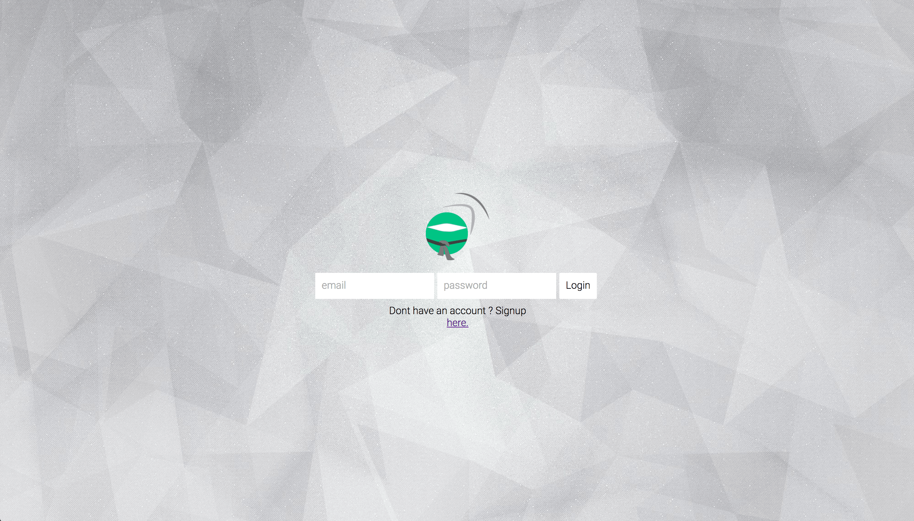
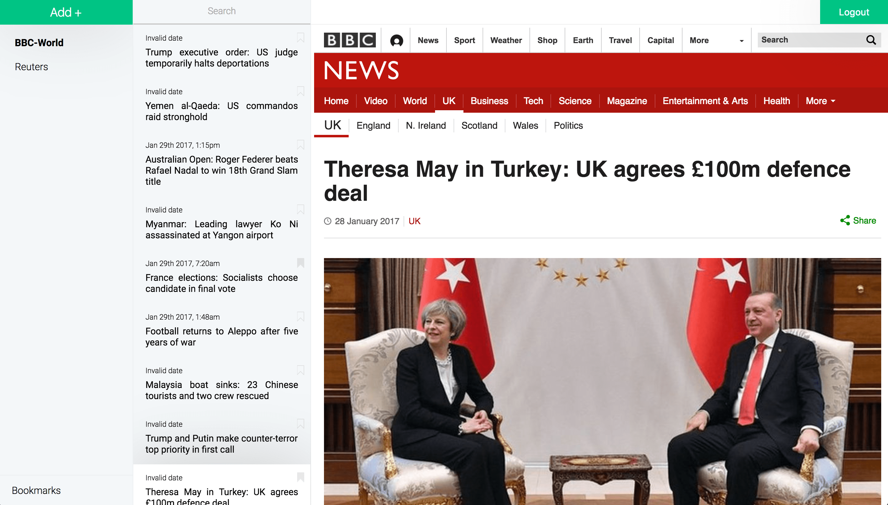
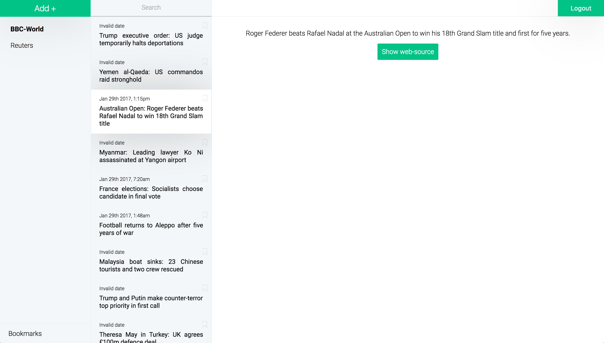

# Rss-Ninja

Front-end of the project Rss-Ninja. Using Redux architecture as well as View/Container pattern.
Need a back-end to run properly (check out @ganitzch).

## How to launch

There is 2 differents way to use the project.

### Local environement
```javascript
npm install
npm start
```

The local server will serve on `localhost:8080`.

### Production environment
```
export NODE_ENV=production
```
```javascript
npm install
npm run build
```

## Preview





